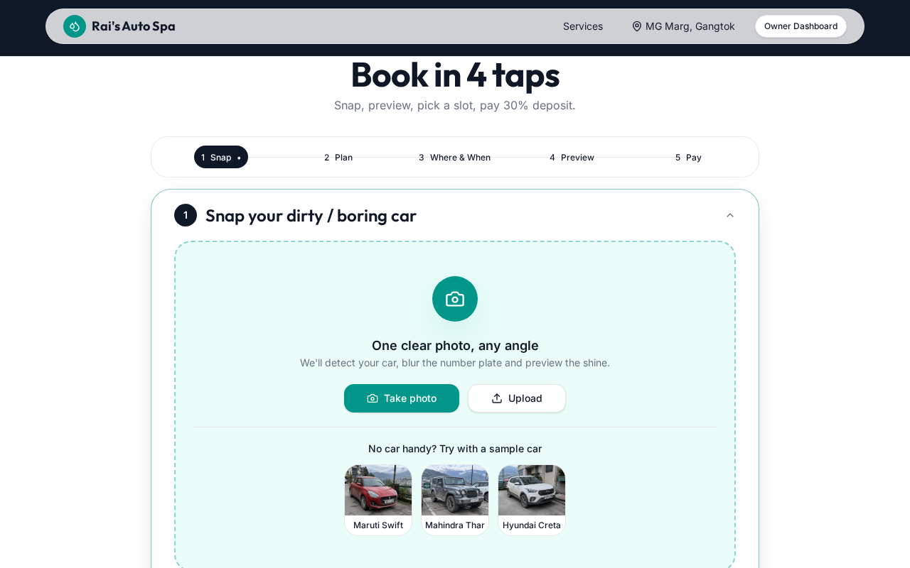
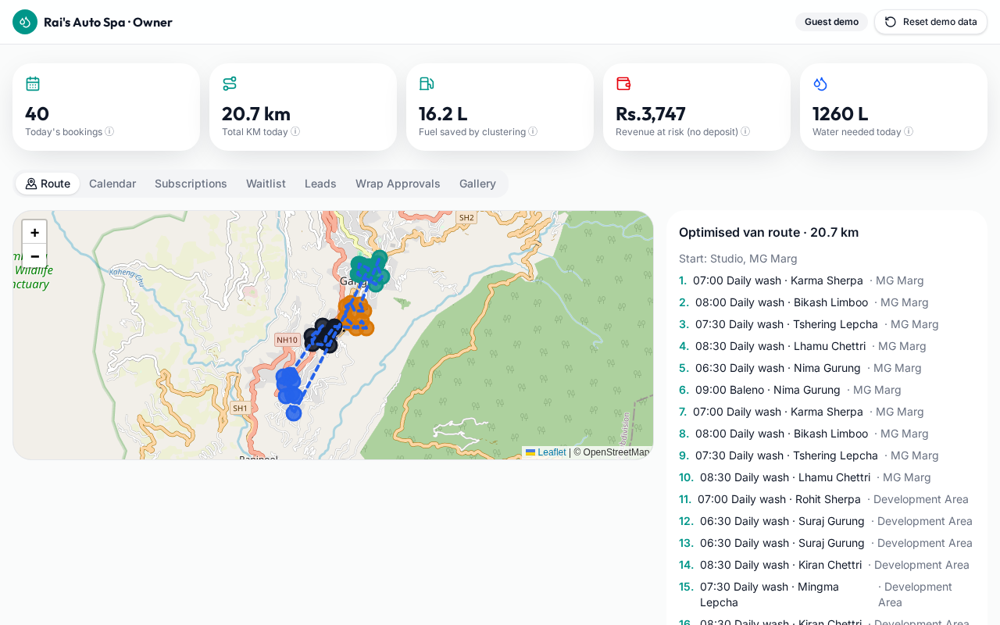
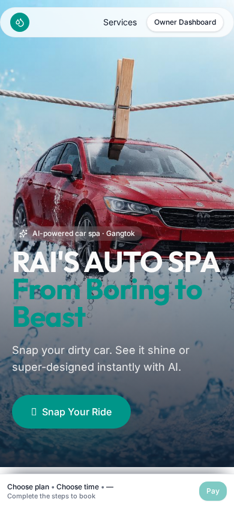
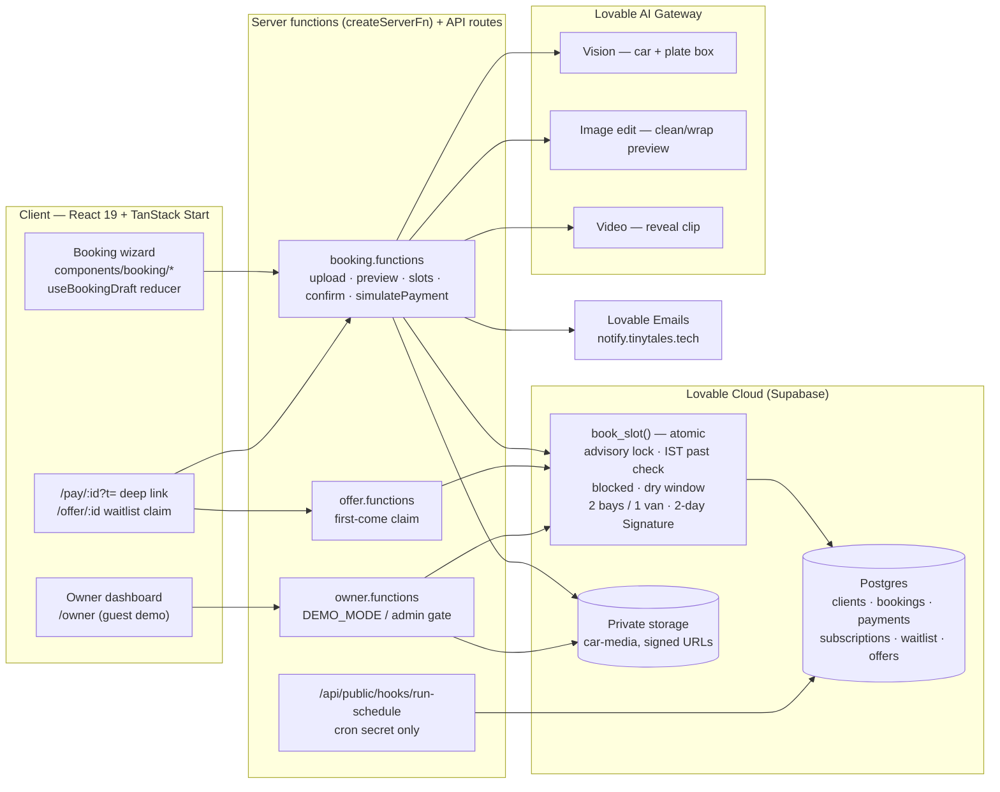

# Rai's Auto Spa — From Boring to Beast

**Snap your dirty car, see it shine with AI, book a bay or the van in four taps.**
A premium car wash and custom-wrap studio on MG Marg, Gangtok, run by one founder (Rai) with 2 studio bays and 1 mobile van. Before this, she ran 1,500 appointments from a notebook.

Live: https://rai-auto-spa.lovable.app · Owner dashboard: `/owner`

| Home | Booking wizard | Owner dashboard | Mobile |
|---|---|---|---|
|  |  |  |  |

## What it does

**Customer**
1. **Snap**: upload or take a photo, or use one of three sample cars. A vision model detects the car and the number plate, and the plate is pixelated before the photo is stored. The original stays private.
2. **Plan**: Essential Wash (Rs.499), Full Detail (Rs.1,999), or Signature Super Design (Rs.25,000, 2 days, AI colour change). Picking a plan quietly starts the AI "after" image and the reveal video in the background.
3. **Where & when**: studio (free, 2 bays) or van (+Rs.200, map pin). The grid handles water: without water on site, the van carries a tank (+Rs.150) and 11am–4pm is blocked. The grid refreshes live.
4. **Reveal**: once a slot is picked, a curtain-wipe before/after slider appears with confetti.
5. **Pay**: 30% deposit through a simulated checkout (UPI / Card / Netbanking, with a "Simulate failure" option). After paying you get calendar, WhatsApp and reschedule links (free until 12h before), plus an in-app preview of both emails. The finished reveal video is emailed automatically.

**Owner (`/owner`)**: an optimised van route with fuel and water stats (every formula shown in a tooltip), a calendar where you drag to block water shortages (bay/van use shown per slot), 40 daily-wash subscriptions (Skip / Pause / Change time, which update the route straight away), a waitlist with automatic backfill offers, leads, wrap approvals, and a gallery.

## 2-minute judge demo

1. Open `/`. In **Snap**, tap **Maruti Swift** under "Try with a sample car". The car is detected and the plate blurred.
2. Pick **Full Detail**. Choose **Come to Studio** and tap any free slot to see the reveal.
3. Enter a name, `+91 98320 12345` and your email. Tap **Pay**, tick **Simulate failure** once to see the retry, then pay for real (demo).
4. On **You're Booked**, tap **Preview your emails**.
5. Open `/owner` and tap **Reset demo data** (under 5s). Walk through **Route**, then **Calendar** (drag a few cells to block them; back on `/` the slots disappear within 10s), then **Waitlist** (cancel a booking to see up to 3 offers; open two claim links at once and exactly one wins).

## Architecture



Private media is served only through short-lived signed URLs. `deposit_paid` can only be set by `simulatePayment` (enforced by a database trigger).

## How DEMO_MODE works

`DEMO_MODE` is a single boolean in `src/lib/owner.functions.ts`, read by `ownerDb()`, the one gate every owner read and write passes through.

- `DEMO_MODE = true` (current): `ownerDb()` returns the privileged server client straight away, so `/owner` is open to anyone. The dashboard is still server-only — the browser never holds a privileged key, and customer manage tokens are never sent to it.
- `DEMO_MODE = false`: `ownerDb()` validates the request's bearer token, looks the user up in `user_roles`, and throws `Owner access only.` unless they hold the `admin` role. No other code changes are needed.

`resetDemo` rebuilds the sample dataset with dates relative to today in India time. It only deletes rows it created itself (`is_seed = true`), so a visitor's in-progress booking survives a reset. The button asks for confirmation and the server enforces a 60-second cooldown. The same seed runs automatically when there is no upcoming seeded data.

## Simulated on purpose

| Area | What happens | What a production build would do |
|---|---|---|
| **Payments** | A checkout that walks Processing → Verifying → Success, with a "Simulate failure" toggle and a visible "Demo payment - no real money" label. Rows land in `payments` with `demo = true`. `deposit_paid` can only be set by `simulatePayment`, enforced by a database trigger. | Razorpay/Stripe order + webhook confirmation. |
| **WhatsApp** | Message text is composed and copied to the clipboard, and links open `wa.me`. Nothing is sent automatically. | WhatsApp Business Cloud API templates. |
| **Email** | Booking confirmation and reveal-video emails are real and do send from `notify.tinytales.tech`. The in-app "Preview your emails" modal renders the exact same templates so judges can read them without a mailbox. | Unchanged. |
| **Owner access** | `/owner` is open to guests. | `DEMO_MODE = false` plus the `admin` role. |
| **AI usage** | Not rate-limited. | Per-user quotas. |

Sender identity and the repo link live in `src/lib/brand.ts`.

## Development

```bash
bun install
bun run dev          # http://localhost:8080
bun run lint         # eslint + prettier, zero warnings
bun run build        # production build
bun run test         # 28 vitest tests (unit + book_slot integration)
bun run test:e2e     # Playwright (TypeScript): full booking with a sample car, owner dashboard
```

**Tests**

- Unit: pricing and the 30% deposit (`src/lib/plans.test.ts`), van route and water/fuel maths (`ops-config.test.ts`), pay gate and slot rules (`booking-rules.test.ts`).
- Integration against the live database (`tests/book_slot.integration.test.ts`): past dates, unknown slots, the dry window, blocked slots, the 2-bay studio cap, a 2-day Signature holding a bay on both days, and two concurrent claims on the last van slot where exactly one must win. These use dates 400+ days out and delete everything they create.
- They need `SUPABASE_URL` and `SUPABASE_SERVICE_ROLE_KEY`. Without them the run prints `integration tests SKIPPED: no service key` and the unit tests still run.
- `E2E_BASE_URL` points the Playwright suite at a deployed URL instead of `localhost:8080`.
- CI (`.github/workflows/ci.yml`) runs lint, tests and build on every push and pull request.

## Accessibility & performance

- Skip link, landmarks and a correct heading order.
- The before/after slider works with the keyboard: arrow keys, PageUp/PageDown, Home and End, with `role="slider"` and live values.
- Labelled step accordion with `aria-expanded` and `aria-current` progress.
- Checkout dialog with focus management and Escape to close.
- Live regions for upload, reveal and payment status.
- `prefers-reduced-motion` turns off confetti, the curtain wipe and the hero video.
- Contrast meets WCAG AA.
- The hero poster paints first. The 11 MB loop loads after hydration and is skipped with data-saver on. Images below the fold are lazy-loaded.

---

Built with [Lovable](https://lovable.dev). Source: https://github.com/Kh3rwa1/rai-auto-spa
